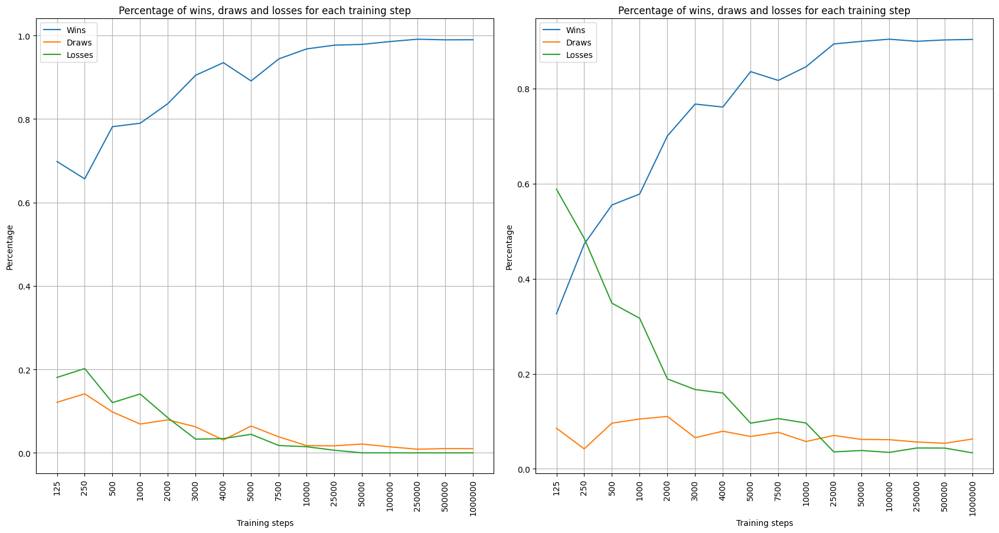
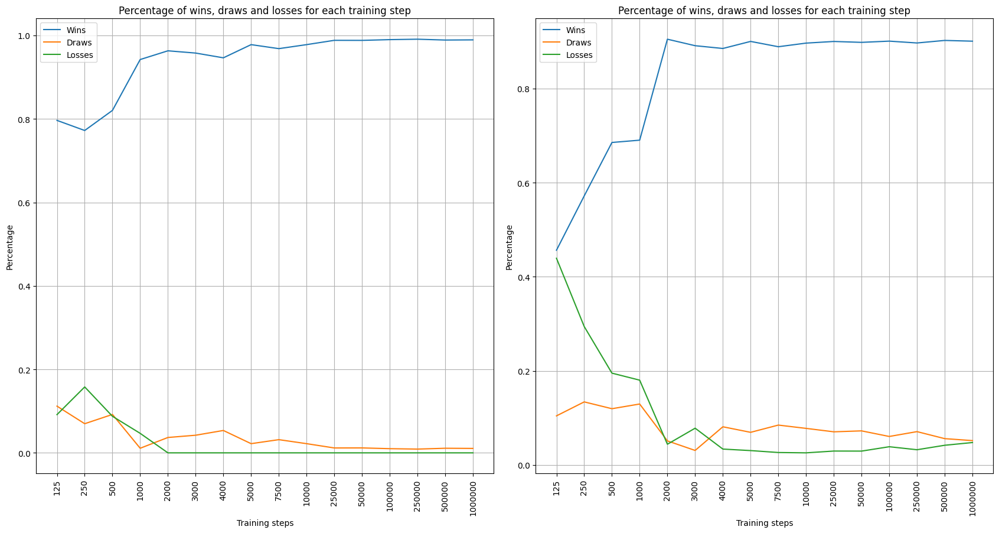

# Lab 10 - Reinforcement Learning 

Use reinforcement learning to devise a [*tic-tac-toe*](https://en.wikipedia.org/wiki/Tic-tac-toe) player.

# Solutions proposed

All proposed solutions are based on a Reinforcement Learning training strategy based on the Monte Carlo method. In fact, *Training Steps* randomly played games are simulated and the end result of these is used to update the policy to be followed based on the evaluation of each possible position in the game. This method works particularly well in the proposed case as the space of possible states is relatively small, so it is possible with just a few *Training Steps* to have an accurate evaluation of the positions in the game even by playing them randomly.

## Basic problem 

In order to have a baseline, I started from the code proposed in the classroom and simply added a method to select, from each state $T$, the action that would lead to the best possible state $T+1$. In the proposed method, after evaluating each game, all states that have been traversed during the game are updated according to the following equation:

$V_{\pi}(s) = V_{\pi}(s) + \epsilon * (Reward - V_{\pi}(s))$

Where $V_{\pi}(s)$ is the value of the state $s$ according to the policy $\pi$, $\epsilon$ is the learning rate and $Reward$ is the reward obtained at the end of the game, in particular $Reward = 1$ if the game is won, $Reward = 0$ if the game is drawn and $Reward = -1$ if the game is lost.

Only the state is considered here since the possible actions of a player from each state are extremely small in number, which is why it is possible to test all moves and assess which of the newly generated states is the most advantageous. 

The developed code, however, only considers matches from the point of view of player 1 (X). This makes the created agent extremely weak should it start second (O). Even using a trick where, at the moment our agent starts second, it tends to minimise instead of maximising the reward (*Trick = True*), our agent manages to draw many more matches but there is a system that works incorrectly and has been trained wrongly for that goal.

## Generalisation of the problem also on O 

For the reasons listed at the end of *Basic Problem*, two improvements have been proposed. The first relates to the division of states between those the agent will play if he starts first and those he will play if he starts as second. From this division it is also possible to modify the $Reward$ so that it is accurate whether the player starts first or second. Therefore for the states relating to the first player the same equation as proposed in *Basic Problem* will be used, whereas in the case of considering player 2 the equation will change as follows:

$V_{\pi}(s) = V_{\pi}(s) + \epsilon * (-Reward - V_{\pi}(s))$

In view of the excellent accuracy achieved with the following method, it was not considered necessary to improve the training, but rather to investigate how to achieve the desired level of accuracy by minimising the number of training steps.

## Multiple Projections Optimisation 

In order to do this, the main objective was to maximise the amount of information obtainable at the end of a game played to train the agent. To do this, 3 transformations were constructed, *rotate_clockwise*, *rotate_counter_clockwise*, and *rotate_180*. Thanks to these transformations, for each game state it is possible to construct 3 new equivalent states that can be updated with the proposed equation. In this way, for each game played, there are four times as many states as with the standard method. 

After the implementation of this method, the duration of the training step remains the same, keeping the results obtained comparable. Observing the experiments in the next section, it can be seen that with the same number of training steps, the proposed method achieves a higher winning percentage.

# Results

All the results below are obtained by averaging the results of 10_000 games. 

## Basic problem 

Tested with 100_000 training steps.

| Scenario               | Player 1 | Draw   | Player 2 |
|--------------------------|------------|----------|------------|
| *Random vs. Random*      | 0.5897     | 0.125    | 0.2853     |
| *Agent vs. Random*       | 0.9849     | 0.0151   | 0.0        |
| *Random vs. Agent*       | 0.9895     | 0.0105   | 0.0        |
| *Random vs. Agent(Trick)*| 0.4895     | 0.4381   | 0.0724     |

I want to emphasise, and show through these results, how the basic implementation is flawed should the agent play as second player.

## Generalisation of the problem also on O

It can be seen that the results obtained are extremely better than the previous ones. Moreover, on average, the winning percentage decreases if the player starts second due to the nature of the game.

| Training Steps | Wins   | Draws  | Losses | Wins   | Draws  | Losses |
|-------------------|----------|----------|----------|----------|----------|----------|
|  | **Player 1**   |   |  | **Player 2**   |   |  |
| *125*             | 0.6982   | 0.1211   | 0.1807   | 0.3262   | 0.0855   | 0.5883   |
| *250*             | 0.6566   | 0.1414   | 0.202    | 0.4729   | 0.042    | 0.4851   |
| *500*             | 0.7817   | 0.098    | 0.1203   | 0.5552   | 0.0962   | 0.3486   |
| *1000*            | 0.7899   | 0.069    | 0.1411   | 0.5783   | 0.1049   | 0.3168   |
| *2000*            | 0.837    | 0.0791   | 0.0839   | 0.7005   | 0.1103   | 0.1892   |
| *3000*            | 0.9049   | 0.0623   | 0.0328   | 0.7675   | 0.0656   | 0.1669   |
| *4000*            | 0.9351   | 0.0307   | 0.0342   | 0.7613   | 0.0792   | 0.1595   |
| *5000*            | 0.8913   | 0.0643   | 0.0444   | 0.8358   | 0.0681   | 0.0961   |
| *7500*            | 0.9441   | 0.0383   | 0.0176   | 0.8173   | 0.0769   | 0.1058   |
| *10000*           | 0.968    | 0.0173   | 0.0147   | 0.8461   | 0.0575   | 0.0964   |
| *25000*           | 0.977    | 0.0168   | 0.0062   | 0.894    | 0.0703   | 0.0357   |
| *50000*           | 0.9789   | 0.0211   | 0        | 0.8995   | 0.0619   | 0.0386   |
| *100000*          | 0.9856   | 0.0144   | 0        | 0.904    | 0.0614   | 0.0346   |
| *250000*          | 0.9913   | 0.0087   | 0        | 0.8996   | 0.0565   | 0.0439   |
| *500000*          | 0.9898   | 0.0102   | 0        | 0.9025   | 0.0538   | 0.0437   |
| *1000000*         | 0.99     | 0.01     | 0        | 0.9035   | 0.0628   | 0.0337   |

## Multiple Projections Optimisation 

The results obtained with this method are extremely satisfying. In fact, it is possible to observe how the number of training steps required to achieve a certain winning percentage decreases with respect to the previous method.

|Training Steps|Wins|Draws|Losses|Wins|Draws|Losses|
|---|---|---|---|---|---|---|
|**Player 1**| | | |**Player 2**| | |
|*125*|0.7965|0.1119|0.0916|0.4564|0.1043|0.4393|
|*250*|0.7723|0.0698|0.1579|0.5718|0.134|0.2942|
|*500*|0.8204|0.092|0.0876|0.6854|0.1195|0.1951|
|*1000*|0.9423|0.011|0.0467|0.6903|0.1295|0.1802|
|*2000*|0.9632|0.0368|0|0.9049|0.0511|0.044|
|*3000*|0.9578|0.0422|0|0.8911|0.0308|0.0781|
|*4000*|0.9464|0.0536|0|0.8852|0.0811|0.0337|
|*5000*|0.978|0.022|0|0.9002|0.0693|0.0305|
|*7500*|0.9684|0.0316|0|0.8889|0.0847|0.0264|
|*10000*|0.978|0.022|0|0.8966|0.0777|0.0257|
|*25000*|0.9883|0.0117|0|0.9001|0.0704|0.0295|
|*50000*|0.9882|0.0118|0|0.8982|0.0724|0.0294|
|*100000*|0.99|0.01|0|0.9008|0.0605|0.0387|
|*250000*|0.991|0.009|0|0.8969|0.0708|0.0323|
|*500000*|0.989|0.011|0|0.9023|0.0559|0.0418|
|*1000000*|0.9894|0.0106|0|0.9007|0.0517|0.0476|

## Comparison graphs between the two methods

In the following pictures, it can be seen that the method proposed in *Multiple Projections Optimisation* achieves better results in less time than the method proposed in *Generalisation of the problem also on O*.

In particular, the first picture shows the results obtained by the method *Generalisation of the problem also on O* with a different number of *Training Steps*. The graph on the left shows the results obtained when the agent was the first player, while the right-hand side shows the results obtained when the agent was the second player. The second picture shows, following the same order, the results obtained by the *Multiple Projections Optimisation* method.

 

# Conclusions
The results obtained in terms of matches won are extremely satisfying. The pipeline followed to first maximise the generalisation of the agent and then the speed of training through reinforcement learning also led to the desired results. Certainly, the method developed is not reproducible for problems that have a very large solution space, or where the action may lead to a non-deterministic state.  

Monte Carlo strategy in the training of the model led to very good results through a relatively simple simulation method. The possibility of intelligently choosing the opponent's moves was evaluated (Minimax), but was not implemented for reasons of time and the excellent victory percentages achieved even by simulating random games. 

The use of transformations led, as expected, to excellent results, not only decreasing the agent's training time, but also making it much more consistent. In the training phase many more positions are evaluated with the same probability, alleviating the risk of having some states less present due to the random nature with which matches are played.